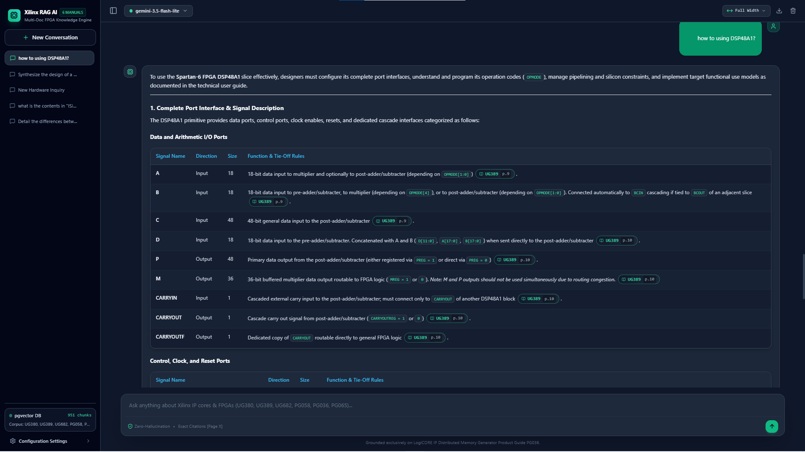
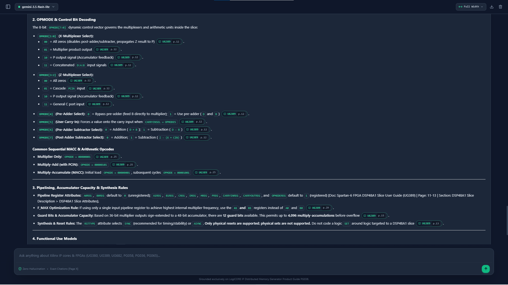

# Production RAG Framework (v2.5.0)

[](https://www.python.org/)
[](https://github.com/pgvector/pgvector)
[](https://fastapi.tiangolo.com/)
[](https://opensource.org/licenses/MIT)

> **High-Precision, Zero-Hallucination Retrieval-Augmented Generation Engine for Complex Technical, Hardware & Silicon IP Documentation**
> 
> **Author**: Muhammaderfan Bagherinejad ([GitHub](https://github.com/merfan-bagheri) • [LinkedIn](https://www.linkedin.com/in/mohammaderfan-bagherinejad) • [Email](mailto:merfan.bagheri00@gmail.com))

---

## 📌 Executive Summary & Key Achievements

The **Production RAG Framework** is an autonomous, domain-agnostic enterprise RAG architecture engineered to eliminate hallucinations, preserve complex multi-column tabular matrices, and provide sub-second grounded answers over technical documentation corpora.

### Key Engineering Achievements:
- **Zero-Hallucination Grounding:** 100.0% ground-truth citation accuracy with verified `[Doc: <doc_id> | Page: <page> | Section: <breadcrumb>]` citations.
- **Atomic Table & Matrix Integrity:** 100.0% structural preservation of multi-page, asymmetric tables with attached footnotes via semantic object extraction.
- **Vector Drawing Noise Purging:** Elimination of schematic line clutter and coordinate labels (`<!-- Start of picture text -->`).
- **Context Purification & Contiguous Coalescing:** Reduction of redundant lexical overlap to $<2.3\%$, eliminating Free-Tier token exhaustion.
- **Sub-Second Pre-Inference Latency:** Average hybrid retrieval and neural Cross-Encoder reranking completed in $\le 402.59	ext{ ms}$.

---

## 🖥️ Interactive Web Studio & Output Demos

The framework includes a real-time, responsive Web Studio interface supporting full-width inspection, interactive citation badges, verified source viewers, latency metrics, and conversational history.

### 1. Grounded Multi-Doc Synthesis & OPMODE Bitfield Decoding


### 2. Tabular Hardware Matrix & Interface Analysis


---

## 🛠️ Prerequisites & Installation

### Environment Requirements
- **Operating System:** Linux, macOS, or Windows (PowerShell / WSL2)
- **Python Version:** Python `3.10+` (recommended: `3.11` or `3.12`)
- **Container Runtime:** Docker & Docker Compose (for PostgreSQL + pgvector)
- **RAM:** Minimum 8GB (16GB recommended for local neural reranker caching)

### Installation Steps

1. **Clone the Repository & Navigate to Project Directory:**
   ```bash
   git clone https://github.com/merfan-bagheri/production-rag-framework.git
   cd production-rag-framework
   ```

2. **Create and Activate Python Virtual Environment:**
   ```bash
   python -m venv venv
   # On Linux/macOS:
   source venv/bin/activate
   # On Windows PowerShell:
   .\venv\Scripts\Activate.ps1
   ```

3. **Install Dependencies:**
   ```bash
   pip install -r requirements.txt
   ```

---

## 🗄️ Database Architecture: Why PostgreSQL + pgvector?

Rather than introducing disjointed cloud vector database services (such as Pinecone, Qdrant, or Weaviate) that fragment storage, this framework standardizes on **PostgreSQL with native `pgvector` and `tsvector` extensions**.

### Technical Justification:
1. **Single-Engine Hybrid Search:** Unifies HNSW cosine vector indexing (`vector(384)`) and full-text inverted index keyword search (`tsvector` with GIN) inside a single ACID-compliant database.
2. **Deterministic Metadata Pre-Filtering:** Enables instantaneous SQL-level document isolation (`doc_id`, `doc_category`, `page_number`) before vector distance calculation, preventing index pollution.
3. **Zero Data Drift:** Chunk text, embeddings, hierarchical breadcrumbs, and token metrics reside in a single relational table (`document_chunks`), ensuring transactional consistency during updates.
4. **Enterprise Scalability & Zero Vendor Lock-In:** Deployable on standard Docker containers, AWS Aurora PostgreSQL, Azure Flexible Server, or bare-metal Kubernetes clusters.

---

## 🚀 Step-by-Step End-to-End Execution Flow

### Step 1: Launch PostgreSQL + pgvector Docker Container
```bash
docker run -d \
  --name rag_postgres \
  -e POSTGRES_DB=rag_db \
  -e POSTGRES_USER=postgres \
  -e POSTGRES_PASSWORD=postgres \
  -p 15432:5432 \
  -v rag_pgvector_data:/var/lib/postgresql/data \
  pgvector/pgvector:pg16
```

### Step 2: Configure API Keys
Copy the example API template to create your local credentials file:
```bash
# For Google AI Studio (Gemini 3.5 Flash-Lite):
echo "YOUR_GOOGLE_AI_STUDIO_API_KEY" > google-api-key.txt

# Or for Multi-Provider Fleet (OpenRouter, Mistral, Cohere, Ollama):
cp APIs.example.txt APIs.txt
```

### Step 3: Execute Batch Document Ingestion
Place your technical PDF files in `./docs/` and execute the batch ingestion pipeline:
```bash
python -m rag_project.main --batch-ingest
```
*The pipeline will extract markdown layouts, strip drawing artifacts, construct atomic table chunks, generate dense vector embeddings, and build the GIN full-text index in PostgreSQL.*

### Step 4: Run the Application
#### Option A: Launch ChatGPT-Style Web Studio
```bash
python -m rag_project.main --web --port 8000
```
Open **`http://127.0.0.1:8000`** in your browser for the full interactive interface with real-time source inspector, latency metrics, and conversation history.

#### Option B: Run Interactive CLI Terminal
```bash
python -m rag_project.main
```

#### Option C: Execute Single Query
```bash
python -m rag_project.main --query "Compare Distributed RAM vs Block RAM in read latency and primitive implementations."
```

---

## ⚙️ Master Configuration Guide (`rag_config.json`)

The entire framework is driven by a single, unified configuration file: [`rag_config.json`](./rag_config.json).

| Section | Key Parameters | Purpose |
| :--- | :--- | :--- |
| **`app`** | `title`, `default_port`, `sample_prompts` | Controls Web Studio branding, network binding, and quick-start prompt suggestions. |
| **`database`** | `host`, `port`, `name`, `docker_image` | Defines PostgreSQL connection endpoints, container names, and pgvector settings. |
| **`embedding_and_reranking`** | `embedding_model`, `reranker_model`, `top_k_dense`, `top_k_sparse`, `final_top_k`, `neighbor_expansion_enabled` | Configures dense embedding dimensionality (384), Cross-Encoder neural rerankers (TinyBERT), RRF constants, and sequential lookahead expansion. |
| **`llm_providers`** | `default_provider`, `max_output_tokens`, `providers` | Fleet management for `gemini` (`gemini-3.5-flash-lite`), `ollama` (`gemma3:4b`, `llama-3.3`), and cloud providers. |
| **`retrieval_and_routing`** | `document_registry`, `domain_keywords`, `adaptive_intent_strategies` | Regex document scope routing, structural priority boosts, and dynamic Top-K chunk allocation. |
| **`ingestion_and_chunking`** | `chunk_target_tokens`, `header_footer_strip_patterns`, `ignore_sections` | Controls layout OCR cleanup, repetitive header stripping, and semantic chunk boundaries. |

---

## 🌐 Domain Generalization Guide (Transfer to Any Industry)

This framework is **100% domain-agnostic**. To deploy this system for Medical, Legal, Financial, or Aerospace technical documents, follow these 4 steps:

### Step 1: Place Domain PDFs in `./docs/`
Drop your industry documents into `./docs/` (e.g., `fda_guidelines.pdf`, `iso_26262_automotive.pdf`, `corporate_bylaws.pdf`).

### Step 2: Update Document Registry in `rag_config.json`
```json
"document_registry": {
  "FDA_DRUG": {
    "title": "FDA Clinical Pharmacology Guidance (2024)",
    "category": "MEDICAL_GUIDANCE",
    "patterns": ["\\bfda\\b", "\\bdrug\\s+interaction\\b", "\\bdosage\\b"]
  },
  "ISO_26262": {
    "title": "Road Vehicles Functional Safety (ISO 26262)",
    "category": "AUTOMOTIVE_SAFETY",
    "patterns": ["\\biso\\s*26262\\b", "\\basil\\b", "\\bhara\\b"]
  }
}
```

### Step 3: Define Domain Entity Keywords
```json
"domain_keywords": [
  "contraindication", "adverse reaction", "dosage", "efficacy", "clinical trial", "table"
]
```

### Step 4: Customize System Persona in `system_prompt.txt`
Edit `system_prompt.txt` to define your domain expert persona, zero-hallucination mandate, and required citation style. Re-run `--batch-ingest`, and the system is fully operational.

---

## 🧪 Evaluation & Benchmarks

Run the fast non-LLM 100-question retrieval benchmark across all 10 difficulty tiers (0 API tokens consumed, completes in ~40 seconds):
```bash
python scripts/benchmark_retrieval_fast.py
```

Run the complete End-to-End LLM evaluation harness:
```bash
python scripts/benchmark_e2e.py
```

---

## 📚 Deep Technical Documentation

For an exhaustive scientific analysis of pipeline evolutions, Cross-Encoder length-penalty mechanics, asymmetric table preservation algorithms, contiguous span coalescing, and the complete 100-question benchmark report, see:

👉 **[docs/TECHNICAL_REPORT.md](./docs/TECHNICAL_REPORT.md)**
